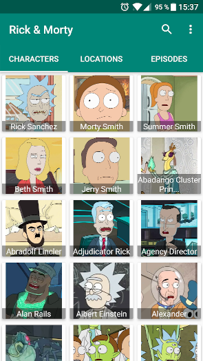
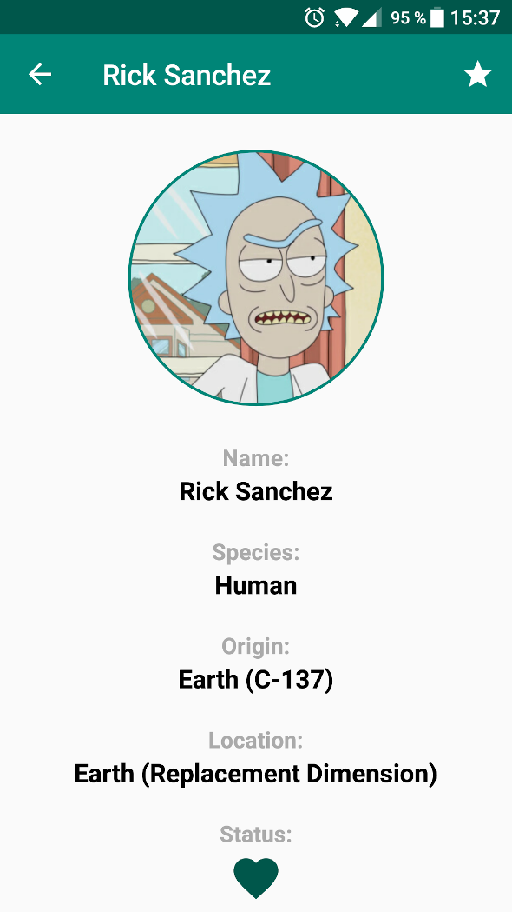

# Rick & Morty App

App show info from [The Rick and Morty Api]

 &nbsp; &nbsp; 

<!---->
<!---->

## Architecture & Design Pattern

Use [Clean Architecture]

* [SOLID]
* [Repository]
* MVVM: [ViewModel] + [Databinding]
* Dependency Inversion: [Koin]
* Observable: [ReactiveX], [LiveData]
* Testing: Unit Test, Integration Test, UI Test
    - [JUnit]
    - [Mockito]
    - [Robolectric]
    - [Espresso]

 
 
 

## Third Party Libraries

* [Retrofit]
* [Koin]
* [ReactiveX]
* [Glide]
* [CircleImageView]
* [Sticky Header]
* [Simple Search View]

## Especial thanks

* [Alex Fuhrmann] for his fantastic job: [The Rick and Morty Api]

## License

    Copyright 2019 Daniel Ávila Domingo

    Licensed under the Apache License, Version 2.0 (the "License");
    you may not use this file except in compliance with the License.
    You may obtain a copy of the License at

        http://www.apache.org/licenses/LICENSE-2.0

    Unless required by applicable law or agreed to in writing, software
    distributed under the License is distributed on an "AS IS" BASIS,
    WITHOUT WARRANTIES OR CONDITIONS OF ANY KIND, either express or implied.
    See the License for the specific language governing permissions and
    limitations under the License.
    
[Clean Architecture]: https://blog.cleancoder.com/uncle-bob/2012/08/13/the-clean-architecture.html
[LiveData]: https://developer.android.com/topic/libraries/architecture/livedata
[ReactiveX]: http://reactivex.io
[ViewModel]: https://developer.android.com/topic/libraries/architecture/viewmodel
[Databinding]: https://developer.android.com/topic/libraries/data-binding
[Repository]: https://martinfowler.com/eaaCatalog/repository.html
[SOLID]: https://en.wikipedia.org/wiki/SOLID
[Koin]: https://insert-koin.io/
[JUnit]: https://junit.org/junit5/
[Mockito]: https://site.mockito.org/
[Robolectric]: http://robolectric.org/
[Espresso]: https://developer.android.com/training/testing/espresso

[The Rick and Morty Api]: https://rickandmortyapi.com/
[Alex Fuhrmann]: https://axelfuhrmann.com/

[Retrofit]: https://github.com/square/retrofit
[Sticky Header]: https://github.com/smuyyh/StickyHeaderRecyclerView
[Simple Search View]: https://github.com/Ferfalk/SimpleSearchView
[Glide]: https://github.com/bumptech/glide
[CircleImageView]: https://github.com/hdodenhof/CircleImageView
